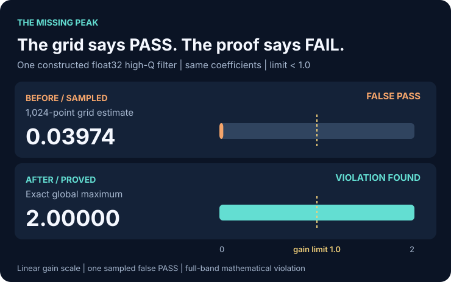
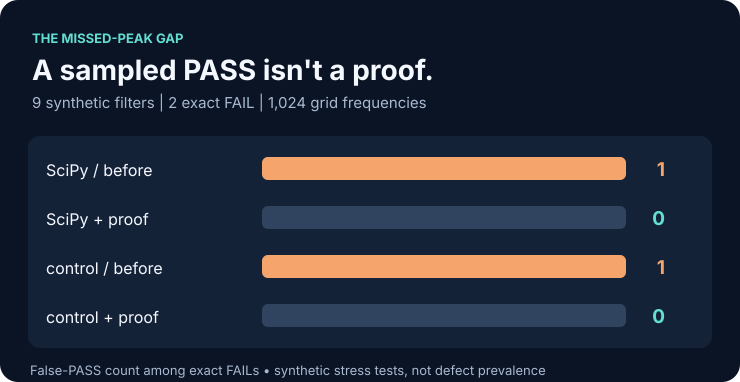
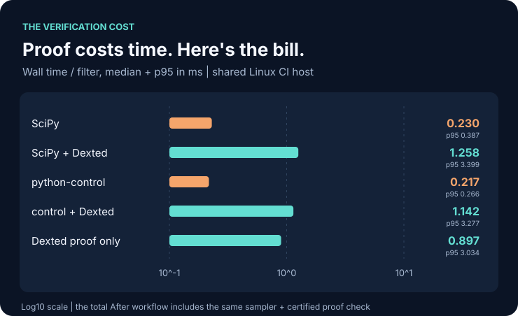

# Dexted DSP

**Catch gain-limit violations that a frequency plot can miss.**

Offline mathematical verification for fixed IIR and SOS filters. Works **alongside** SciPy and python-control; it is not an audio-processing accelerator.

## 1. One filter. Two opposite verdicts.

<picture>
  <source media="(max-width: 600px)" srcset="benchmarks/competitive/figures/peak-gap-mobile.svg">
  
</picture>

The **same float32 filter coefficients**, tested against the same **strict gain limit of 1.0**:

- **Before — sampled grid:** largest observed gain **0.03974** → *PASS* (incorrect).
- **After — exact whole-band check:** proven maximum **2.0** → **FAIL** (correct).

This is one intentionally constructed high-Q filter. A numerical frequency response is an estimate, **not a promised mathematical certificate**. [Reproduce the hidden peak](examples/hidden_peak/README.md).

## 2. Measured with two real DSP tools

<picture>
  <source media="(max-width: 600px)" srcset="benchmarks/competitive/figures/decision-mobile.svg">
  
</picture>

| Actual library | Before: false PASS | With Dexted: false PASS |
|---|---:|---:|
| SciPy `signal.freqz_sos` | **1** | **0** |
| python-control `frequency_response` | **1** | **0** |

Both tools missed **the same single case** among **9 preselected synthetic filters**. Dexted's decisions matched an independent SymPy exact-root oracle on **9/9** cases. These are **not production failure rates**.

## 3. The price of certainty: higher latency

<picture>
  <source media="(max-width: 600px)" srcset="benchmarks/competitive/figures/runtime-mobile.svg">
  
</picture>

- **SciPy** p50: **0.230 → 1.258 ms** (**+1.028 ms**).
- **python-control** p50: **0.217 → 1.142 ms** (**+0.925 ms**).

Dexted adds mathematical verification, **not speed**. Figures come from **30 timing repetitions per case and method** on one shared Linux host. The differences are *differences of medians*, not paired mean overhead.

[Raw observations, p95 and environment](benchmarks/competitive/results/run-20261008.json) · [Full protocol and limitations](benchmarks/competitive/README.md) · [Python-allocation chart](benchmarks/competitive/figures/memory.svg)

## 4. Reproduce the evidence

Use **Python 3.13** for this pinned third-party benchmark (the Dexted core supports Python 3.10+). Copy the commands below; installation and full benchmark execution take longer than 30 seconds:

```bash
git clone https://github.com/dextune/dexted-dsp.git
cd dexted-dsp
python -m pip install . 'numpy==2.3.5' 'scipy==1.17.0' 'control==0.10.2' 'sympy==1.14.0'
dexted-dsp demo hidden-peak
OPENBLAS_NUM_THREADS=1 OMP_NUM_THREADS=1 python benchmarks/competitive/run.py --out validation/my-competitive-run.json --trials 30 --memory-trials 30
python tools/audit_competitive.py validation/my-competitive-run.json
```

The private repository requires GitHub access. The output directory must be unused.

## 5. Verify your deployed filter

```python
from scipy.signal import butter
from dexted_dsp import inspect_sos, verify_inspection

sos = butter(8, 0.2, output="sos")
proof = inspect_sos(sos, precision="float32", fs=48_000, max_gain=1.01)
print(proof.status, proof.reason)
proof.save("proof.json")
assert verify_inspection(proof.as_dict(), sos, precision="float32", fs=48_000, max_gain=1.01)
```

Or enforce an offline deployment gate:

```bash
dexted-dsp inspect examples/safe.json --output proof.json --report report.md
dexted-dsp verify examples/safe.json proof.json
```

Only exit code **0** passes. Nonconforming inputs fail closed; resource-limited checks return `unknown` (exit **3**). Python has no required third-party runtime dependencies.

**Available:** exact real-coefficient biquad gain/stability tests, SOS cascade proofs, independently rechecked Python certificates, C++20 predicates, JSON/Markdown reports and binary32 export inspection.

**Not proved:** audio throughput, real-device quantization/runtime error, arbitrary MIMO/DNN graphs, certified SOS peak-frequency locations or general hardware safety.

## 6. Project maturity and validation

**Research alpha, not a certified safety product or approved public package.** Native Linux/macOS/Windows CI and the synthetic SymPy crosscheck pass, but real customer data, an external mathematics audit and independent cross-hardware replication are still required. [Implementation status and remaining gates](docs/product/implementation-status.md).

Earlier synthetic high-Q stress (separate archived experiment): **356 / 485** grid1024 and **213 / 485** grid16384 false accepts, versus **0 / 485** exact predicates. Not field prevalence. [Archived methodology](docs/en/benchmarks/BENCHMARKS.md).

[Documentation](docs/README.md) · [Python/C++ API](docs/reference/README.md) · [Math proof](docs/research/proofs/biquad.md) · [EQ export integration](docs/product/eq-workflow.md) · [Independent review request](docs/research/review/INDEPENDENT_REVIEW_PACKET.md) · [한국어](docs/ko/README.md) · [日本語](docs/ja/README.md) · [简体中文](docs/zh-CN/README.md)

[](https://github.com/dextune/dexted-dsp/actions/workflows/ci.yml)

