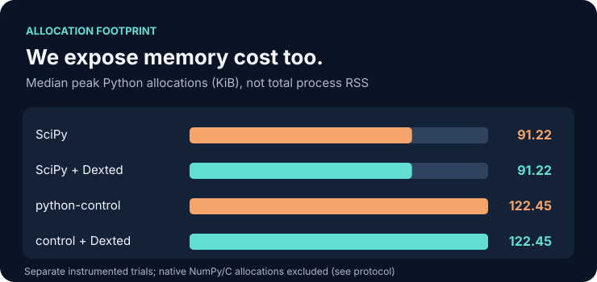

# Dexted DSP

**The frequency plot passes. The exact gain bound does not.**

<picture>
  <source media="(max-width: 600px)" srcset="benchmarks/competitive/figures/decision-mobile.svg">
  
</picture>

| **Missed specification violations** | **Independent mathematical agreement** | **Added median verification time** |
|:---:|:---:|:---:|
| **1 → 0 per baseline** | **9 / 9 cases** | **+1.028 ms SciPy / +0.925 ms control** |
| One *shared constructed* high-Q filter, not two production incidents | SymPy exact-root oracle vs Dexted decision | Additional cost, **not** a speedup |

**Start reproducing in 30 seconds (copy-paste; installation and benchmark execution take longer):**

```bash
git clone https://github.com/dextune/dexted-dsp.git && cd dexted-dsp
python -m pip install . 'numpy==2.3.5' 'scipy==1.17.0' 'control==0.10.2' 'sympy==1.14.0'
OPENBLAS_NUM_THREADS=1 OMP_NUM_THREADS=1 python benchmarks/competitive/run.py --out validation/my-competitive-run.json --trials 30 --memory-trials 30
python tools/audit_competitive.py validation/my-competitive-run.json
```

<sub>9 **synthetic** float32 SOS cases · 1,024 frequencies · 30 repeats each · one shared Linux host. Grid results are estimates, not mathematical proofs. Dexted proves only the ideal fixed-coefficient transfer function, not runtime/device safety. Private repository: clone access required.</sub>

<picture>
  <source media="(max-width: 600px)" srcset="benchmarks/competitive/figures/runtime-mobile.svg">
  
</picture>

<picture>
  <source media="(max-width: 600px)" srcset="benchmarks/competitive/figures/memory-mobile.svg">
  
</picture>

**Wall-time p50 / p95, ms:** SciPy `0.230 / 0.387` → `1.258 / 3.399`; control `0.217 / 0.266` → `1.142 / 3.277`. One shared synthetic miss; p50 differences are *not* paired mean overhead. Traced allocations exclude native memory and RSS.

[Methods and limitations](benchmarks/competitive/README.md) · [Raw data + environment](benchmarks/competitive/results/run-20261008.json) · [Oracle audit](tools/audit_competitive.py) · [SVG generator](benchmarks/competitive/plot.py)

---

**Verify the whole band beyond a frequency grid.** · Python 3.10+ · C++20 · MIT

[](https://github.com/dextune/dexted-dsp/actions/workflows/ci.yml) · [Docs](docs/README.md) · [Python/C++ API](docs/reference/README.md) · [Archived v0.1.0 evidence](benchmarks/results/benchmark.json) · [Current-code synthetic pilot](benchmarks/suites/PROTOCOL_V2.md) · [한국어](docs/ko/README.md) · [日本語](docs/ja/README.md) · [简体中文](docs/zh-CN/README.md)

## The problem: sampling can return a false PASS


For the included **synthetic adversarial** biquad, a 1,024-point inclusive frequency grid measures a largest gain of about **0.03974**, and would pass a gain-1 check. The **mathematically proven global maximum is exactly 2.0**. Dexted DSP rejects the filter using exact arithmetic over the entire frequency band, not a larger grid.

```bash
dexted-dsp demo hidden-peak  # reproducible, no SciPy/NumPy required
```

In the archived **synthetic high-Q stress family** (1,024 filters, 485 exact failures), an inclusive 1,024-point grid falsely accepted **356 / 485**, a 16,384-point grid **213 / 485**, and the exact integer predicate **0 / 485**. This is *not* a production failure rate or a claim that sampling tools promise mathematical certification. See the [full benchmark methodology](docs/en/benchmarks/BENCHMARKS.md), [raw results](benchmarks/results/benchmark.json) and [limitations](docs/research/README.md).

## Use it on your own deployed filters

Dexted DSP certifies the **final represented coefficients**, including explicit float32 rounding. It checks strict Schur stability and a requested strict peak gain limit for fixed real biquads and Python SOS cascades.

```python
from scipy.signal import butter  # optional; Dexted DSP itself has no runtime dependencies
from dexted_dsp import inspect_sos, verify_inspection

sos = butter(8, 0.2, output="sos")
result = inspect_sos(sos, precision="float32", fs=48_000, max_gain=1.01)
print(result.status, result.reason)     # certified certified
print(result.gain_bounds.as_dict())     # provable rational gain enclosure, when available
result.save("filter-proof.json")
assert verify_inspection(result.as_dict(), sos, precision="float32", fs=48_000, max_gain=1.01)
```

Or use a JSON input for a fail-closed deployment gate:

```bash
dexted-dsp inspect examples/safe.json --output proof.json --report report.md
dexted-dsp verify examples/safe.json proof.json
```

Only exit code `0` passes a deployment gate. Rejections return `1`, invalid inputs `2`, resource-limited `unknown` returns `3`. The existing `check` and `verify` commands and v1 certificates remain supported.

## Real integration path: parametric EQ export

Generate a three-band EQ with the [W3C Audio EQ Cookbook](https://www.w3.org/TR/audio-eq-cookbook/) formulas, round the actual deployment coefficients to float32, inspect the full SOS chain and reverify the certificate:

```bash
python examples/eq_release_pipeline.py --max-gain 2.0
```

The 1,200-case [EQ design catalog](benchmarks/suites/EQ_CATALOG_PROTOCOL.md) and [SymPy exact-real-root auditor](tools/sympy_oracle_audit.py) add a **different algorithmic correctness check**; all coefficients are *designed synthetic fixtures*, not product-field statistics or an external human audit. [Walkthrough](docs/product/eq-workflow.md).

## What you get — and what you do not

| Available today | Outside the certified model |
|---|---|
| Exact, whole-band biquad stability + strict gain decision (Python & C++20) | Audio processing/throughput acceleration or perceptual improvement |
| Python SOS certificate with independently rationally rechecked dyadic cover | Finite-precision runtime/quantization-error or device-safety proof |
| Provable peak-gain **enclosures**, plus single-biquad exact cosine peak intervals | General MIMO, arbitrary DNN graphs or automatic filter repair |
| JSON/Markdown inspection, deterministic demos, CI-friendly status | Crouzeix theorem or OpenAI exact-DFT runtime integration |

An SOS bound may be wide or unavailable. `rejected` need not imply instability. The digest is **not** a signature; proof belongs offline, not in an audio callback.

**Project status:** research alpha; source installation only until a release is independently approved and published. The repository is currently private, so cloning requires access. This is independently maintained and AI-assisted, not an official OpenAI project or an externally audited safety tool. Source mathematics used by the executable predicate is classical; [OpenAI research is a separate conditional exploration](docs/research/README.md).

[Exact peak-location proof](docs/research/proofs/peak-localization.md) · [Getting started](docs/en/getting-started/USER_GUIDE.md) · [Inspection API](docs/product/inspection.md) · [Proof details](docs/research/proofs/biquad.md) · [Testing](docs/en/guides/TESTING.md) · [Roadmap and gates](docs/product/implementation-status.md) · [C++ API](docs/reference/cpp-api.md)


